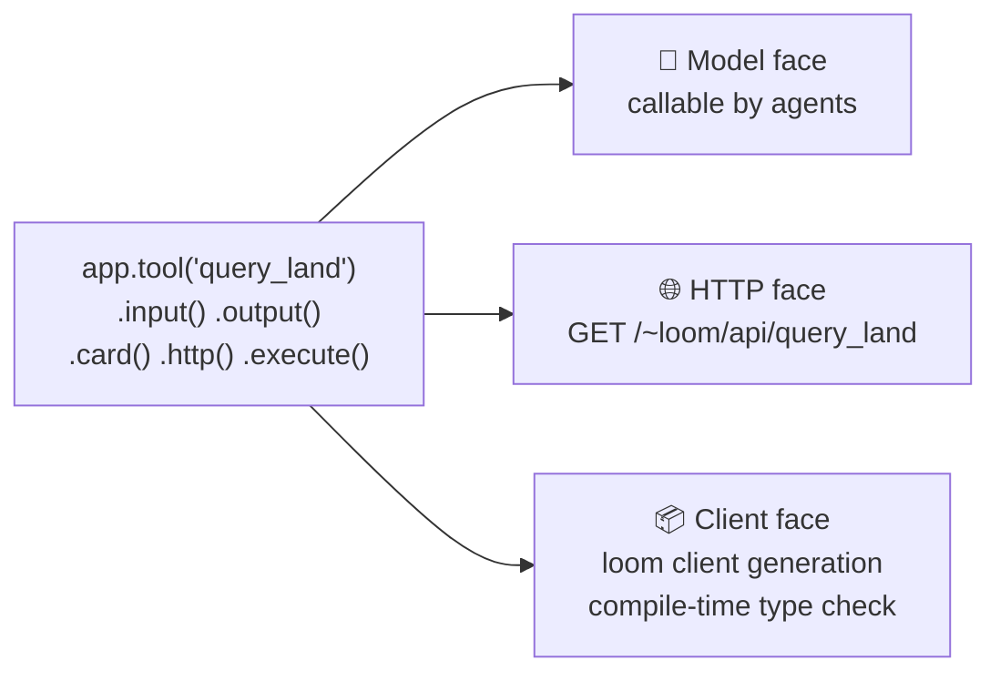
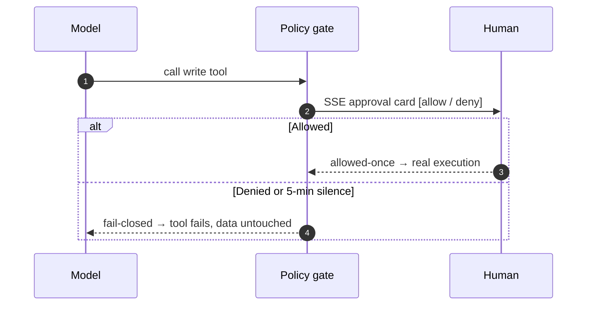
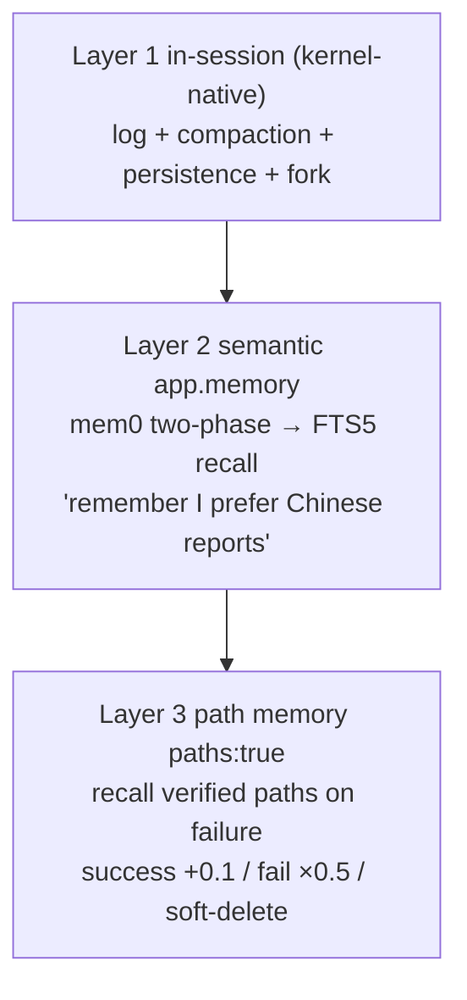
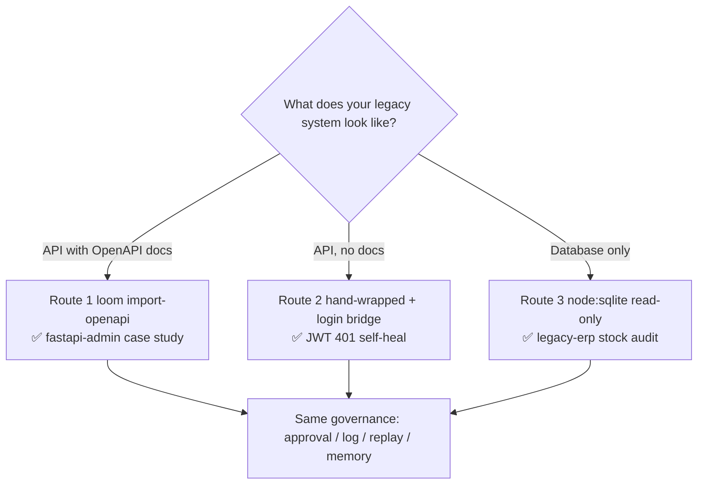

# Loom


**The agent-native web framework — FastAPI for the age of agents, built on [DeepSeek Harness](https://github.com/deepseek-ai/deepseek-harness).**

English | [中文](README.zh.md)

> **M1-M8 shipped** · 338+1 tests green · MIT · 3 runnable examples · full status in [docs/status.md](docs/status.md)

---

## Understand it in 30 seconds


**Plain words**: you only write the top layer (declare your business); the four layers below come for free. The frontend is just a messenger and a display — every fact enters the session log before it flows anywhere, so refresh = replay, disconnect = resume by seq, afterwards = byte-exact audit replay.

---

## Core capabilities at a glance

### One declaration, three faces



Change a tool signature → regenerate → the frontend **fails at compile time**.

### Writes require a human (fail-closed)



### Memory in three layers



### How legacy systems come in (three routes)



### OpenAPI dual-track + Python tool bridge

```mermaid
flowchart LR
    subgraph Brownfield
        FA[FastAPI legacy] -->|import-openapi| T[becomes Loom tools]
    end
    subgraph Greenfield
        L[.http() declaration] -->|loom openapi| O[OpenAPI 3.1<br/>+ live-doc endpoint]
    end
    PY[Python @tool<br/>geopandas/sklearn] -->|stdio bridge| T2[model-callable tools]
```

**TypeScript for the framework and frontend, Python for tools, legacy FastAPI via OpenAPI — three developer populations, one session-log kernel.**

> 📊 Full gallery (13 diagrams incl. message sequence, tenancy, replay debugging, plugin ecosystem, CI gates): [docs/diagrams.zh.md](docs/diagrams.zh.md) (Chinese)

---

## Quickstart

Requires Node.js ≥ 22.13 and pnpm ≥ 10:

```bash
pnpm install && pnpm build:sdk
cd examples/gis
# put DEEPSEEK_API_KEY=sk-your-key in .env (template: .env.example)
pnpm loom dev        # one command: agent service (4620) + frontend (5173), hot reload
```

Open http://localhost:5173 and try:

- **"查询所有村庄的地类面积占比，画出饼图，聚焦最大村"** — tool cards appear in order; the pie chart really renders
- **"让研究员核对连河村和太平河村的数据，汇总差异"** — multi-agent panel streams parent/child sessions side by side
- **"用 Python 统计各村占比的均值和标准差"** — the model calls a Python tool; the reply cites real statistics

Scaffolding a new app / production deploy / headless API checks: see the Quickstart section of [docs/features.md](docs/features.md).

---

## Examples

| Example | One-liner |
|---|---|
| [`examples/gis`](examples/gis/loom.app.ts) | GIS digital workers (5 tools + 3 agents + subagent + webhook + Python bridge + memory) |
| [`examples/legacy-erp`](examples/legacy-erp/README.zh.md) | Legacy integration, offline simulation: a 2018 ERP via three routes; approvals gate real stock changes (CI-runnable) |
| [`examples/fastapi-admin`](examples/fastapi-admin/README.zh.md) | Legacy integration, flagship: the real open-source FastapiAdmin (1k★) joined Loom with zero source changes; JWT login bridge with 401 self-heal |

---

## Documentation map

| Want | Go |
|---|---|
| **Learn by diagrams** (13 Mermaid + 2 SVG) | [diagram gallery](docs/diagrams.zh.md) (Chinese) |
| **Getting started** (10-min / first app / API cheat sheet / FAQ) | [learn.html](docs/learn.html) (open in any browser, Chinese) |
| **🖼 Comic intro** (8 panels · the smart restaurant) | [comic](docs/comic.zh.md) (Chinese) |
| **📖 Comic book** (23 panels · 15 chapters, beginner/expert dual track, covers the whole Harness) | [harness-book](docs/harness-book.zh.html) (Chinese) |
| Deep design (axioms / API-to-kernel mapping / competitor matrix) | [whitepaper](docs/whitepaper.zh.md) (Chinese) |
| Feature deep-dives (M2-M8 chapters) | [features](docs/features.md) |
| Status & roadmap | [status](docs/status.md) |
| Python bridge / auth / memory / path memory / plugin ecosystem | [python-tools](docs/python-tools.zh.md) · [auth](docs/auth.zh.md) · [memory](docs/memory.zh.md) · [path-memory](docs/path-memory.zh.md) · [plugin-ecosystem](docs/plugin-ecosystem.zh.md) |

## License

[MIT](LICENSE)
