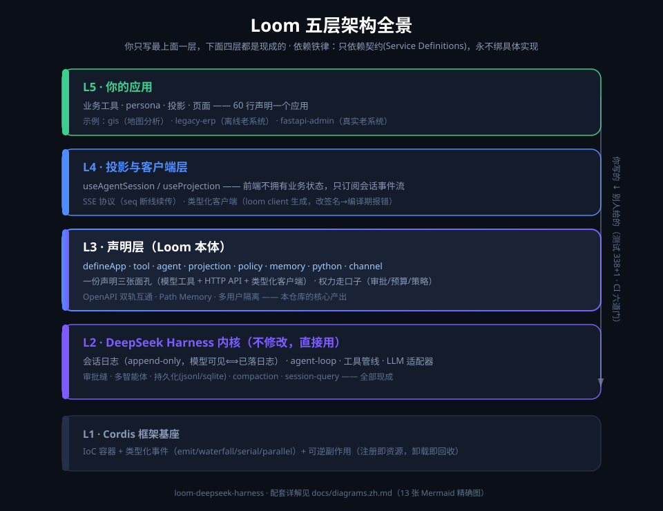
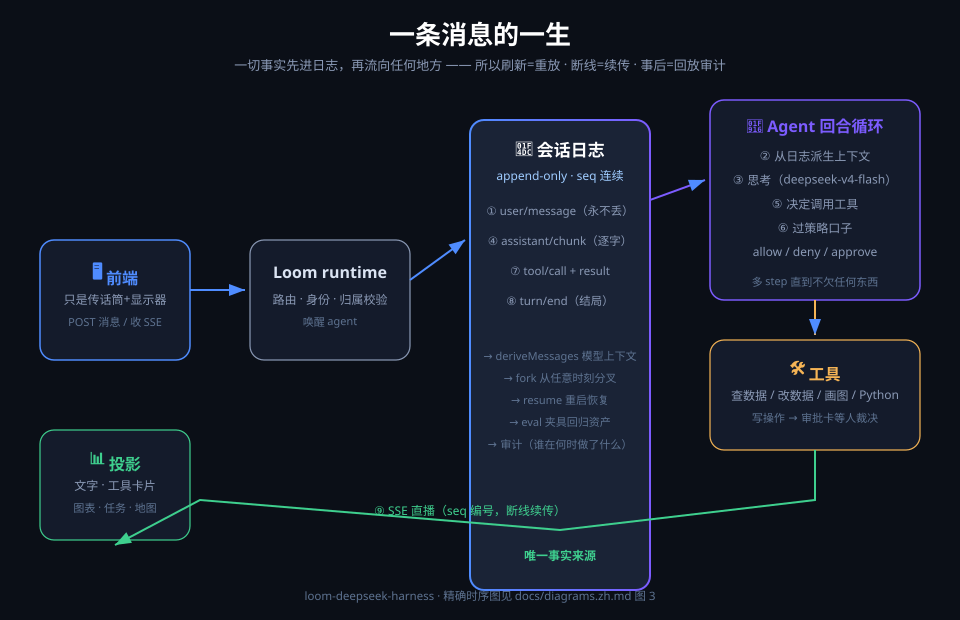
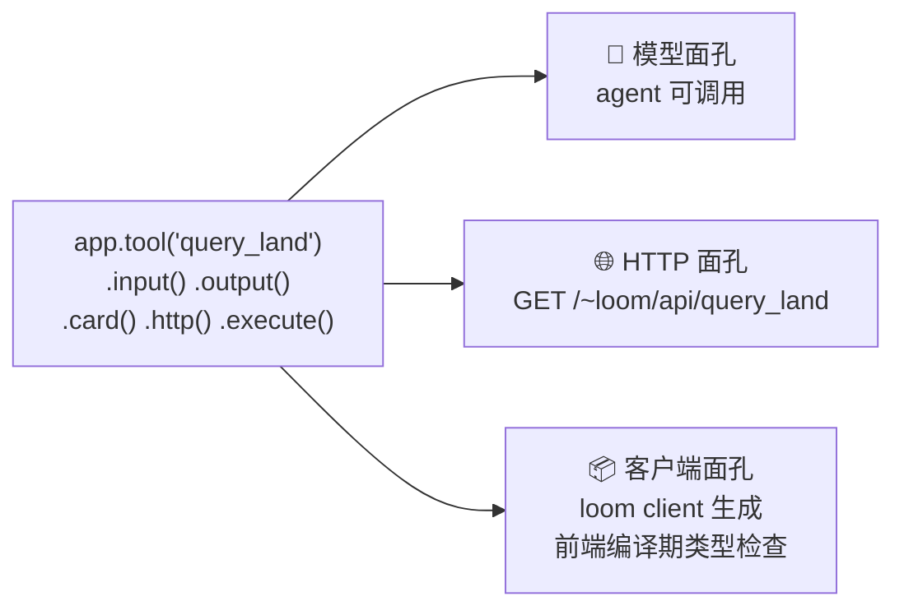
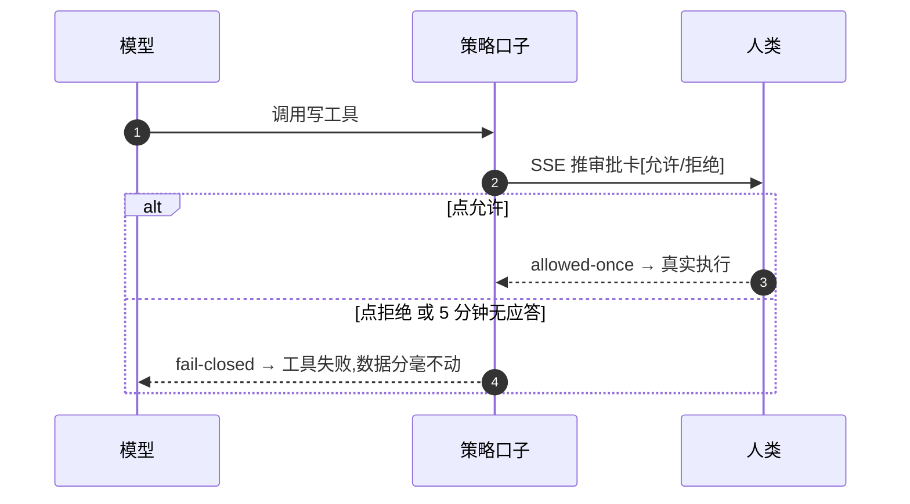
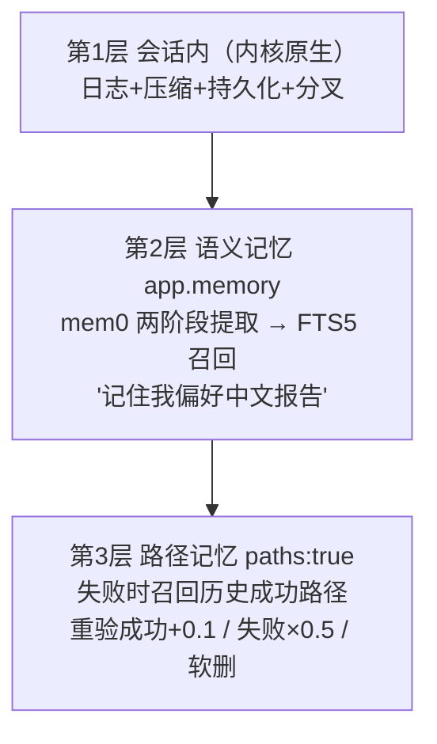
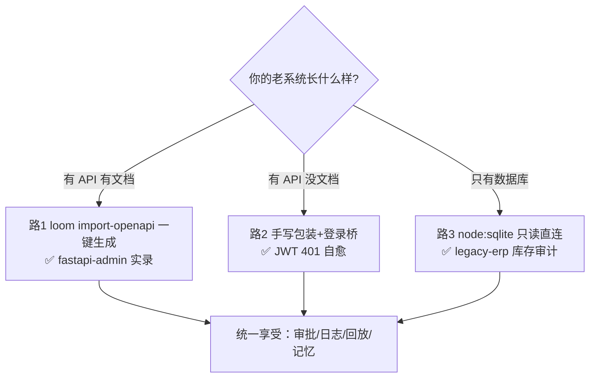

# Loom


**智能体原生的 Web 框架 —— 智能体时代的 FastAPI，构建于 [DeepSeek Harness](https://github.com/deepseek-ai/deepseek-harness) 之上。**

[English](README.md) | 中文

> **M1-M8 全量交付** · 338+1 测试全绿 · MIT · 三个可运行示例 · 详细状态见 [docs/status.zh.md](docs/status.zh.md)

---

## 30 秒看懂





**大白话**：你只写最上面一层（声明业务），下面四层白送。前端只是"传话筒+显示器"，一切事实先进会话日志再流向任何地方——所以刷新=重放、断线=续传、事后=逐字节回放审计。

---

## 核心能力一图流

### 一份声明，三张面孔



后端改签名 → 重新生成 → 前端**编译期**报错。

### 写操作必须过人这关（fail-closed）



### 记忆三层：会话内白送，跨会话可召回，路径会风化



### 企业的老系统怎么进来（三路决策）



### OpenAPI 双轨互通 + Python 工具桥

```mermaid
flowchart LR
    subgraph 存量路
        FA[FastAPI 老系统] -->|import-openapi| T[变成 Loom 工具]
    end
    subgraph 新建路
        L[.http() 声明] -->|loom openapi| O[OpenAPI 3.1<br/>+活文档端点]
    end
    PY[Python @tool<br/>geopandas/sklearn] -->|stdio 桥| T2[模型可调工具]
```

**TS 写框架与前端，Python 写工具，存量 FastAPI 走 OpenAPI 进来——三大开发者群体，共享同一个会话日志内核。**

> 📊 完整图解（13 张，含消息时序/多用户隔离/回放调试/插件生态/CI 门）：[docs/diagrams.zh.md](docs/diagrams.zh.md)

---

## 快速开始

需要 Node.js ≥ 22.13 与 pnpm ≥ 10：

```bash
pnpm install && pnpm build:sdk
cd examples/gis
# .env 写入 DEEPSEEK_API_KEY=sk-你的key（模板见 .env.example）
pnpm loom dev        # 一条命令：智能体服务(4620) + 前端(5173)，改声明热重启
```

打开 http://localhost:5173 试这三句：

- **"查询所有村庄的地类面积占比，画出饼图，聚焦最大村"** —— 工具卡片依次出现，饼图真实渲染
- **"让研究员核对连河村和太平河村的数据，汇总差异"** —— 多智能体面板同屏直播父/子会话
- **"用 Python 统计各村占比的均值和标准差"** —— 模型调 Python 工具，回复带真实统计数字

从零新建应用 / 生产部署 / 无 UI 接口自检：见 [docs/features.zh.md](docs/features.zh.md) 快速开始一节。

---

## 示例

| 示例 | 一句话 |
|---|---|
| [`examples/gis`](examples/gis/loom.app.ts) | 国土 GIS 数字员工（5 工具+3 智能体+子智能体+webhook+Python 桥+记忆） |
| [`examples/legacy-erp`](examples/legacy-erp/README.zh.md) | 老系统对接·离线模拟：2018 年进销存 ERP 三路接入，下单走审批、库存真实扣减（CI 可跑） |
| [`examples/fastapi-admin`](examples/fastapi-admin/README.zh.md) | 老系统对接·旗舰实录：真实开源项目 FastapiAdmin（1k★）一行不改接进 Loom，JWT 登录桥 401 自愈 |

---

## 文档地图

| 想了解 | 去哪 |
|---|---|
| **看图学**（13 张 Mermaid + 2 张 SVG） | [图解手册](docs/diagrams.zh.md) |
| **🖼 漫画入门**（8 幅 · 智能餐厅故事） | [comic](docs/comic.zh.md) |
| **入门上手**（10 分钟/第一个应用/API 速查/FAQ） | [学习指南 learn.html](docs/learn.html)（浏览器直接打开） |
| 深度设计（公理/API 到内核映射/竞品矩阵） | [白皮书](docs/whitepaper.zh.md) |
| 各能力详解（M2-M8 章节全文） | [features](docs/features.zh.md) |
| 状态与路线图 | [status](docs/status.zh.md) |
| Python 工具桥 / 认证 / 记忆 / 路径记忆 / 插件生态 | [python-tools](docs/python-tools.zh.md) · [auth](docs/auth.zh.md) · [memory](docs/memory.zh.md) · [path-memory](docs/path-memory.zh.md) · [plugin-ecosystem](docs/plugin-ecosystem.zh.md) |

## 许可证

[MIT](LICENSE)
