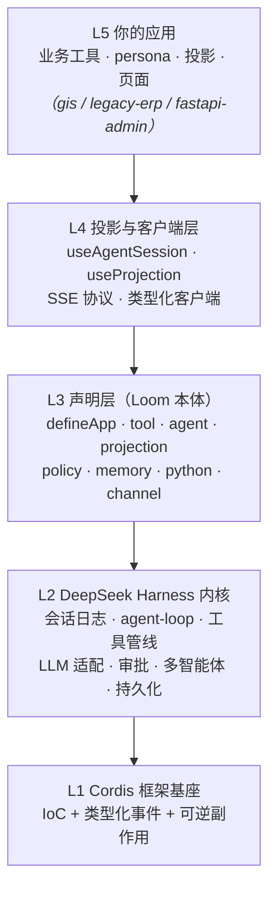
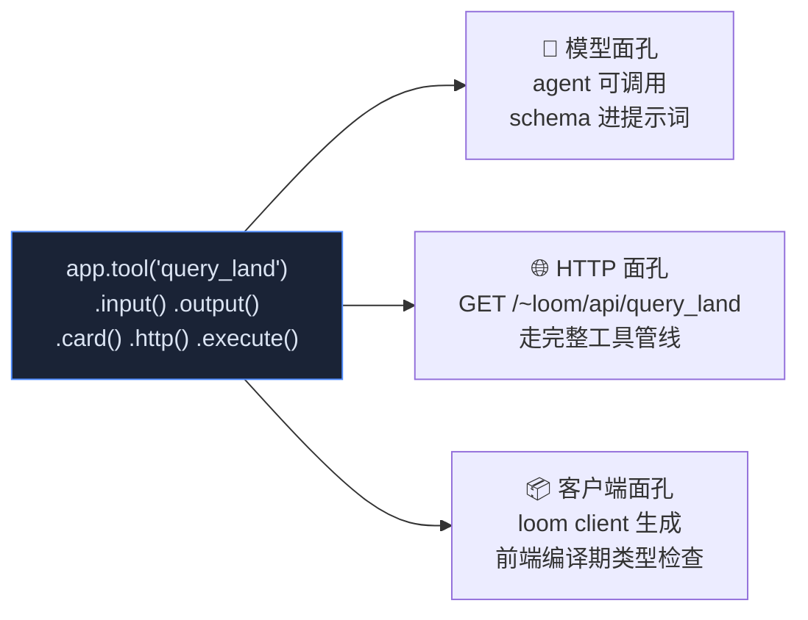
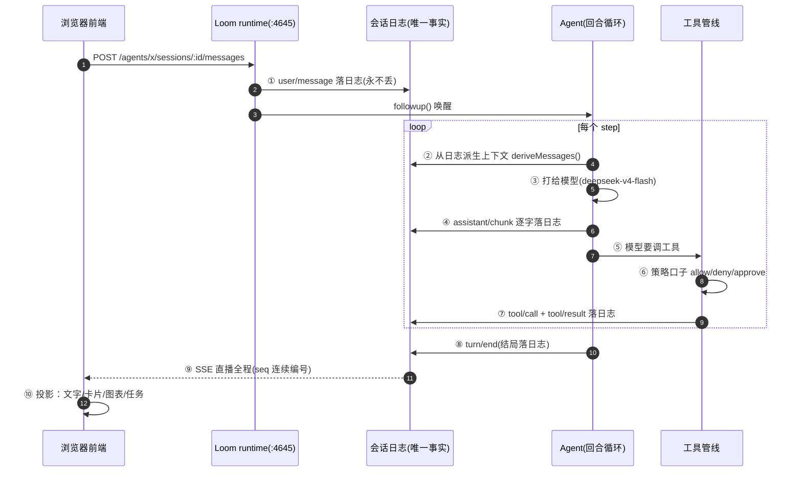
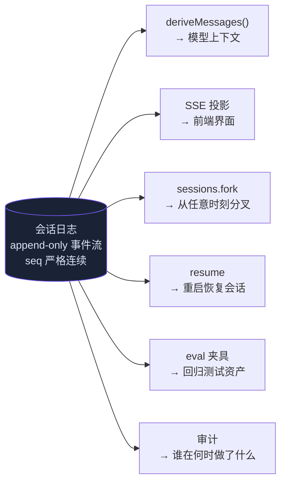
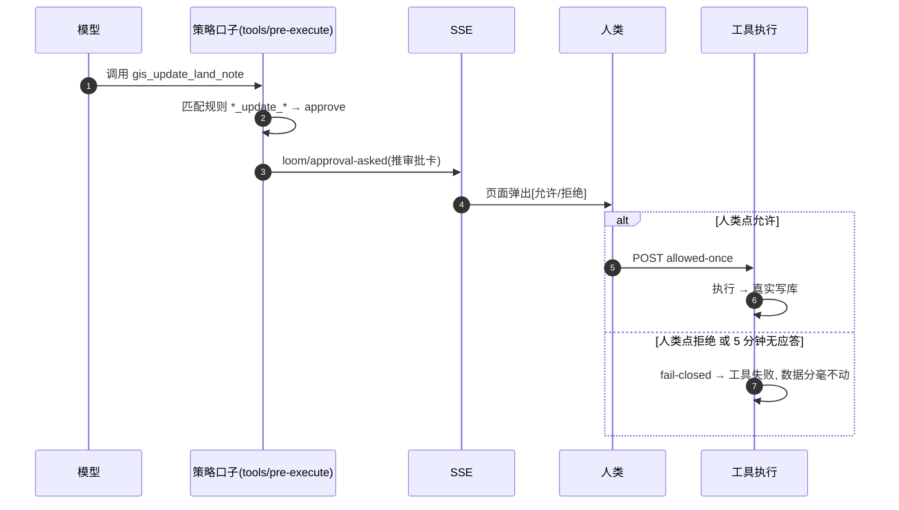
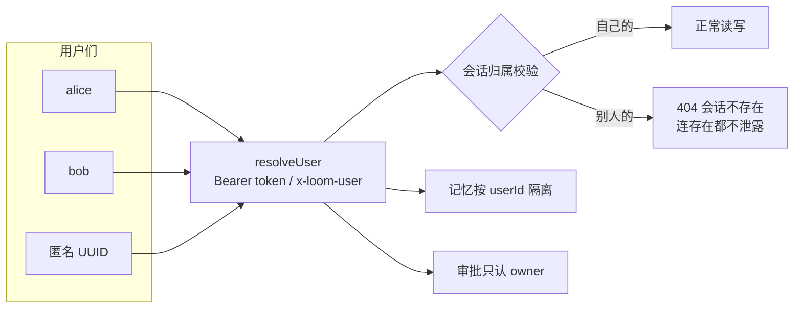
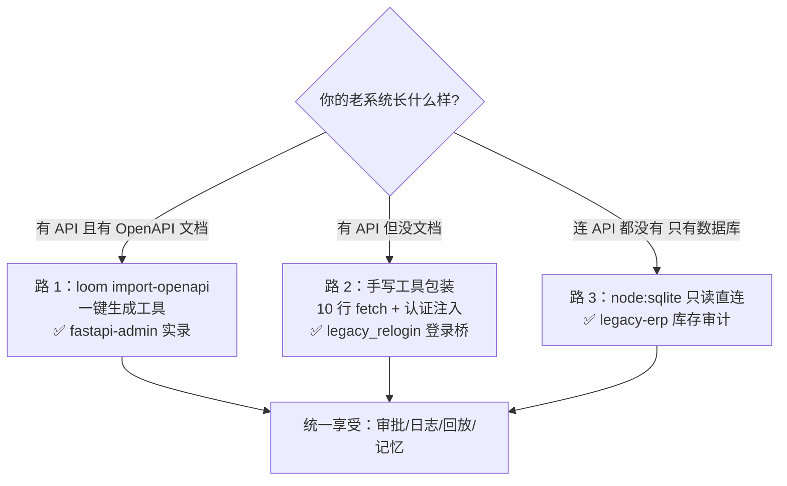
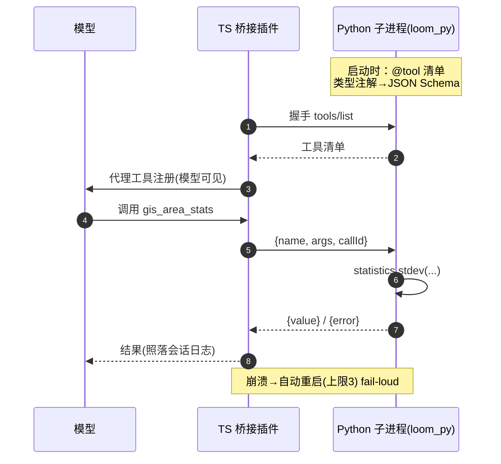
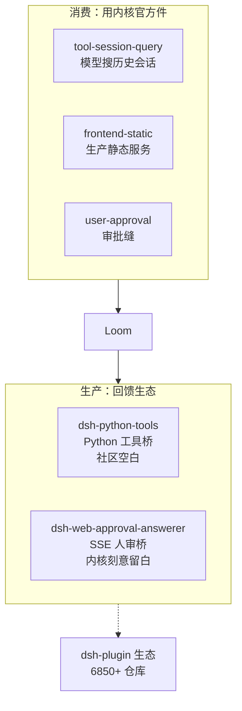
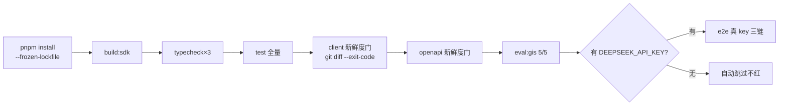

# Loom 图解手册（diagrams.zh.md）

> 一图胜千言。本页用 **Mermaid** 精确表达架构与数据流（GitHub 原生渲染，源码可维护）；
> 两张"给人看"的手绘 SVG 概览图见 [docs/img/](img/)。
> 所有图都可以点开 mermaid 源码改——这本身就是"文档即代码"。

---

## 1. 五层架构：Loom 站在巨人肩膀上



**大白话**：你只写最上面一层（声明业务），下面四层都是现成的。依赖铁律：Loom 只依赖内核的 Service Definitions，永不绑具体实现——所以模型、沙箱、持久化随时可换。

---

## 2. 一份声明，三张面孔（A1 公理）



**大白话**：写一次，得三个。后端改了工具签名 → 重新生成 → 前端**编译期**立刻报错。这就是 FastAPI"一个装饰器=路由+校验+文档"的智能体时代版本。

---

## 3. 一条消息的一生（核心时序）



**大白话**：前端只是传话筒+显示器；一切事实先进日志再流向任何地方——所以**刷新=重放、断线=按 seq 续传、事后=逐字节回放审计**。

---

## 4. 会话日志：唯一事实来源



**大白话**：六个消费者共享一份事实。这就是"transcript is the contract"——审计、调试、评测、分叉全是读日志，不需要第二套系统。

---

## 5. 审批闭环（fail-closed）



**大白话**：写操作必须过人这关；没人应答=自动拒绝（不是放行）。断线重连会**重发未决审批卡**（幂等，不复活已决卡）。

---

## 6. 记忆系统三层

```mermaid
flowchart TD
    subgraph 会话内记忆[第 1 层：会话内 - 内核原生]
        S1[会话日志+压缩+持久化<br/>重启可恢复 可分叉]
    end
    subgraph 语义记忆[第 2 层：跨会话语义 - app.memory]
        E[回合结束] --> EX[阶段一：提取候选事实]
        EX --> DEC[阶段二：与相似旧记忆比对<br/>ADD/UPDATE/DELETE/NOOP]
        DEC --> DB[(SQLite FTS5<br/>按用户隔离)]
        DB --> RE[新会话首条消息<br/>FTS top-K 召回]
        RE --> INJ[form:'recall' 注入<br/>防注入框包装]
    end
    subgraph 路径记忆[第 3 层：路径 - paths:true]
        FAIL[任务失败] --> SEARCH[检索历史成功路径]
        SEARCH --> PINJ[注入"待重验路径"]
        PINJ --> VERIFY[重验：先重跑只读步骤]
        VERIFY -->|成功| UP[confidence+0.1<br/>verified_at 刷新]
        VERIFY -->|失败| DOWN[confidence×0.5<br/>连续失败→软删]
    end
```

**大白话**：第 1 层白送；第 2 层记"事实偏好"（你说"记住我偏好中文报告"，下个会话它还记得）；第 3 层记"怎么做成过一件事"——失败时翻出旧路，但**必须重验才能复用**，路径会"风化"。

---

## 7. 多用户隔离



**大白话**：三套资产（会话/审批/记忆）全部按人隔离。别人的东西不是"403 禁止"而是"404 不存在"——不告诉外人这里有个宝藏。

---

## 8. OpenAPI 双轨互通

```mermaid
flowchart TD
    subgraph 存量路[存量路：老系统进来]
        FA[FastAPI 老系统<br/>/openapi.json] --> IMP[loom import-openapi]
        IMP --> GEN[生成工具声明<br/>诚实降级+WARN]
        GEN --> REG[registerImportedTools 一行接入]
    end
    subgraph 新建路[新建路：Loom 走出去]
        DECL[.http() 工具声明] --> EXP[loom openapi]
        EXP --> DOC[OpenAPI 3.1.0 文档<br/>+ 运行时活文档端点]
        DOC --> ECO[Swagger/网关/<br/>其他 agent 框架]
    end
```

**大白话**：老系统不用改一行代码就能获得"模型面孔+审批"；你的 Loom 应用也能一键变成标准 OpenAPI 服务被全世界调用。

---

## 9. 三路老系统接入决策图



**大白话**：无论老系统多老，总有一条路进来。进来之后，治理能力一视同仁。

---

## 10. Python 工具桥



**大白话**：TS 写框架和前端，Python 写工具（geopandas/sklearn 随便用）——两种语言，同一个日志内核，审批照常生效。

---

## 11. 时间旅行回放调试

```mermaid
flowchart LR
    subgraph 调试面板
        LIST[事件流列表<br/>seq/type/name] --> SLIDE[滑块选任意 seq]
        SLIDE --> SNAP["此刻状态快照<br/>(纯函数折叠 events≤seq)"]
        SNAP --> FORK[从此点分叉按钮]
    end
    FORK --> F[POST fork {atSeq}]
    F -->|turn 边界| NEW[新会话:前缀逐事件一致]
    F -->|turn 中间| E400[400 OPEN_TURN+提示]
```

**大白话**：线上出问题，拖回去看"当时模型看到了什么"——不是模拟，是事实重放（请求可从日志逐字节重建）。

---

## 12. 插件生态：消费 + 生产



**大白话**：不只是拿，也给。我们抽出的两个插件包正是社区缺的位——这就是"万物皆插件"的另一半。

---

## 13. CI 六道门



**大白话**：改了声明忘了重新生成客户端？CI 直接挂。会话行为变了？transcript 重放断言会抓到。
